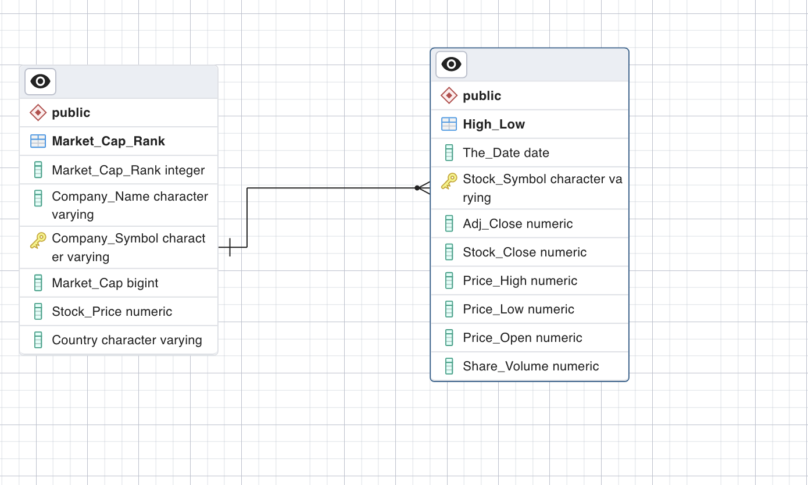

# Automaker Stock Data Analysis & Visualization

**Topic:** Analysis of Auto manufacturer's stock price changes following the IPO of Tesla (2010-2022)
  
## Project Proposal
For a detailed project proposal, please click [here](https://github.com/SavannahWithAnH/TopAutomakersStock_Visualizations/blob/main/Group%204%20Proposal.docx) and select 'View raw'.

# Contributors & Responsibilities
- Alex Kopp - Python/Flask App
- Andrew Skorupa - SQL/Entity Relational Diagram
- Savannah Porter - Data Conversions/Javascript/Bar & Line Charts
- Mohamed Abou elkhier - HTML/CSS/Map/JavaScript
 
## Datasets
Click [here](https://www.kaggle.com/datasets/prasertk/top-48-automakers-daily-stock-prices-20102022) to view one of our primary datasets!

## Project Deliverables
Our project will provide answers to the following questions:
- Which companies have gained the most market capitalization post the IPO of Tesla?
- Which companies have lost the most market capitalization post the IPO of Tesla?
- Where are these companies located globally? 

# Data collection, cleaning, analysis, and visualization tools
- SQL for database and table setup, data validation, exploration, and analysis. we divided to 3 parts
    - PART 1: Datebase and table setup
    - PART 2: Data validation and exploration
    - PART 3: Data Analysis:
        - Ranking companies excluding Tesla.
        - Finding the top ten countries by market capitalization.
        - Querying data specifically for Tesla.
        - Calculating market capitalization using share price and volume information.
    - Entity Relationship Diagram was also created using pgAdmin4 and saved as "ERD.png" to represent the visual of the relationship between our two data set 
    

- Python and panda to clean and convert csv files to json.

- CSS for styling and we broke it down to 3 PARTS
    - Part 1: This section sets up basic HTML and body settings like setting the height to 100%. It also sets up the #map element's height and width.
    - Part 2: This section includes styles for specific elements or classes.We define the dimensions for the .img-flag class, styles for the .well class, etc.
    - PART 3: This part of our CSS code includes the styles for the .exit-button class which is a button in the map to zoom out to original view.

- HTML for constructing the web page which divided to 3 sections:
    - Header : it includes doctype, metadta and various sylesheets and scripts.
    - Stylesheets: bootstrap for web design ,Leaflet for interactive map and local style. css file
    - Body content : It includes containers for our map, line chart, and bar chart. It also has a drop-down selector and information panel.
    - Scripts: jQuery , and the local javascript file leaflet-timeline-slider.js

- Java Script: we used Jave Script for our web development. Our repo cintains 3 JavaScript files:
    - automakers.js:

    - infoMap.js: This JavaScript code mainly functions to generate an interactive map using the Leaflet library. It visualizes different car manufacturers around the globe. The map's primary features include customized marker icons based on company rankings, a timeline slider, and an 'exit' button to revert the map to the initial view.
        - Function getIconSize(rank, symbol): This function calculates the size of a marker icon based on a company's rank. Tesla is assigned a fixed size, whereas the size of other companies' markers is adjusted based on their ranking, with the number one is the biggest and number ten is the smallest
        - Function reformatData(data): This function reformats the data for ease of use. It loops through the input data and reformats it into an array of objects, each containing information about a company.
        - Layer Initialization: Two tile layers are created, one for 'street' view and another for 'satellite' view. Layer groups for car manufacturers and rankings are also initialized. Then a map is created with the 'street' view and 'ranking' layers.
        - Loading Data and Timeline Slider: The data is loaded from a JSON file. A timeline control slider is added to the map. When the user changes the timeline, the data is reloaded, and markers representing car manufacturers are created and added to the 'carManufacturers' layer group. These markers have custom icons and a click event that zooms into the marker's location.
        - Layer Control Addition: Layer controls are added to the map, which allow users to toggle between 'street' and 'satellite' views, and between 'ranking' and 'manufacturer info'.
        - Exit Button: An exit button is added to the bottom right of the map. Clicking this button reverts the map view back to its original center and zoom level.
    - leaflet-timeline-slider.js: Leaflet plugin that creates a customizable timeline slider. Original implementation of timeline at https://svitkin.github.io/leaflet-timeline-slider/ 

- Plotly for interactive bar and line graphs visualizing stock price changes over time.  
- Javascript utilizing 'd3', HTML, and CSS to create and display interactive graphs & charts with proper formatting.
- Flask app using 'render_template' to serve up the dashboard and jsonify to pull in data files enabling dashboard.

### [Entity Relational Diagram](https://github.com/SavannahWithAnH/TopAutomakersStock_Visualizations/blob/main/SQL/ERD.png)
 

 
 

**Please visit our individual Github pages below**  
[Alex Kopp](https://github.com/alexkopp12)  
[Andrew Skorupa](https://github.com/AndyMSkor)  
[Savannah Porter](https://github.com/SavannahWithAnH)  
[Mohamed Abou elkhier](https://github.com/nabroo101)  
 
